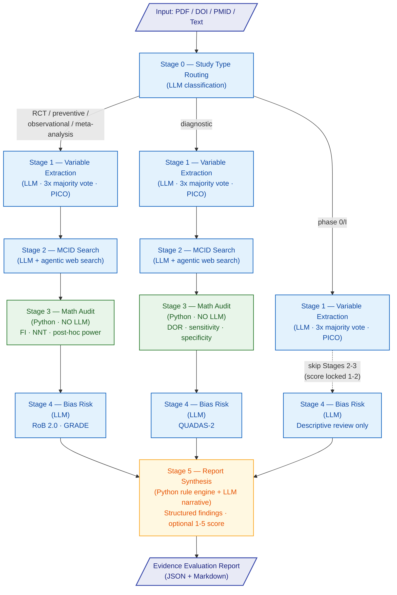

# Figure 1 — Evidence Evaluator Pipeline Architecture

**Legend**

| Color | Meaning |
|-------|---------|
| Blue | LLM-driven stage |
| Green | Deterministic Python (no LLM) |
| Amber | Hybrid (Python rule engine + LLM narrative) |
| Indigo | Pipeline input / output |

> **Note:** Phase 0/I studies bypass Stages 2 and 3 entirely (dashed arrow) and have their score locked to 1--2. Diagnostic studies follow the full pipeline but use QUADAS-2 for bias assessment and DOR instead of Fragility Index / NNT in the math audit.
